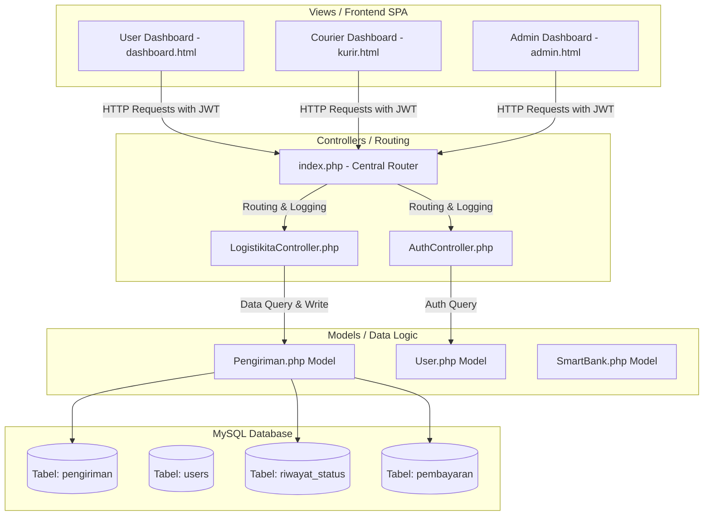
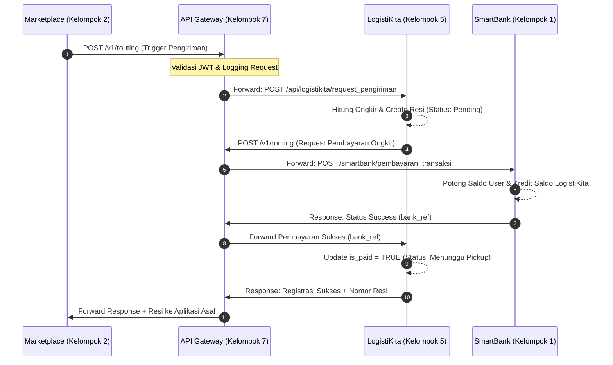
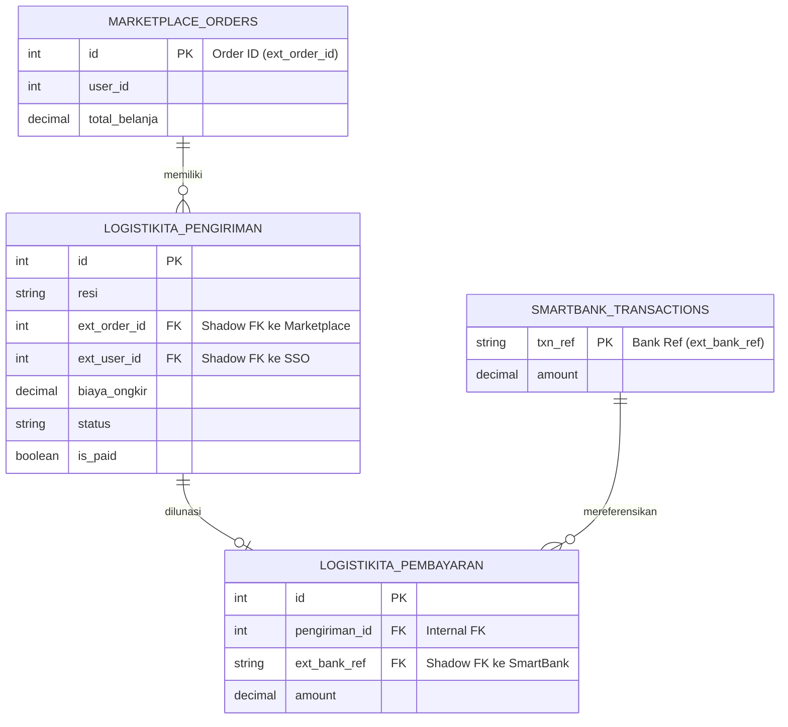

# LogistiKita - Ekspedisi & Distribusi Logistik Modern (Kelompok 5)

LogistiKita adalah Sistem Informasi Manajemen Ekspedisi dan Distribusi Logistik berbasis web yang dirancang sebagai tulang punggung pengiriman fisik dalam ekosistem digital terintegrasi. Sistem ini berfungsi sebagai *Physical Supply Chain Resolver* yang menghubungkan Marketplace atau SupplierHub dengan otoritas keuangan pusat (SmartBank) melalui perantara API Gateway.

---

## 1. Panduan Ekspor Diagram ke Laporan
> [!IMPORTANT]
> Diagram di dalam dokumen ini ditulis menggunakan **Mermaid Syntax** (teks). Untuk mengekspornya ke Microsoft Word/PDF:
> 1. Salin blok kode diagram Mermaid (dari ` ```mermaid ` hingga ` ``` `).
> 2. Buka [mermaid.live](https://mermaid.live).
> 3. Tempelkan kode di kolom kiri, lalu unduh hasilnya sebagai gambar PNG/SVG melalui panel aksi.

---

## 2. Deskripsi & Konteks Sistem

### 2.1 Deskripsi Aplikasi
LogistiKita bekerja dengan prinsip *data-driven logistics*. Transaksi pengiriman dipicu secara otomatis oleh pesanan belanja sukses dari Marketplace. Sistem kemudian memvalidasi data pengiriman, menghitung ongkos kirim secara algoritmik, menghasilkan nomor resi pelacakan unik, dan mengintegrasikan pembayaran ke SmartBank. Kurir lapangan dan operator Hub dapat memperbarui status checkpoint paket secara real-time.

### 2.2 Stakeholders & Batasan Sistem
1.  **User (Pengirim/Pelanggan/UMKM):** Memantau status pengiriman secara real-time dan melakukan estimasi tarif.
2.  **Kurir (Armada Lapangan):** Melihat daftar antrean tugas penjemputan dan pengantaran, serta memperbarui status paket hingga terantar (*delivered*).
3.  **Admin (Pusat Pengendali):** Memantau seluruh siklus logistik, mengelola kurir, dan memantau log aktivitas sistem.
4.  **SmartBank (API Eksternal):** Menangani proses debet rekening pelanggan secara otomatis tanpa penyimpanan saldo langsung di LogistiKita (*Stateless Finance*).

---

## 3. Fitur Utama & Alur Proses (Input - Proses - Output)

Setiap fitur dalam LogistiKita mematuhi pola desain Input-Proses-Output (IPO) yang eksplisit:

### 3.1 Fitur 1: Request Pengiriman (`/logistikita/request_pengiriman`)
*   **Input:** `user_id` (pengirim), `penerima_nama`, `penerima_telp`, `penerima_alamat`, `berat` (kg), `layanan` (Reguler/Express), `biaya_ongkir`.
*   **Proses:** Validasi kelengkapan parameter $\rightarrow$ Hasilkan nomor resi alfanumerik unik (`LKT-` + acak) $\rightarrow$ Registrasi pengiriman ke database dengan status awal `pending`.
*   **Output:** JSON sukses berisi nomor resi dan detail status registrasi.

### 3.2 Fitur 2: Tracking Status (`/logistikita/tracking_status`)
*   **Input:** `resi`, `status` (`menunggu_pickup` / `pickup` / `transit` / `delivery` / `delivered`), `lokasi`, `keterangan`.
*   **Proses:** Cari resi di database $\rightarrow$ Update status pengiriman utama $\rightarrow$ Simpan baris checkpoint ke tabel `riwayat_status`.
*   **Output:** JSON konfirmasi pembaruan log perjalanan.

### 3.3 Fitur 3: Biaya Pengiriman (`/logistikita/biaya_pengiriman`)
*   **Input:** `asal`, `tujuan`, `berat` (kg), `layanan`, `asuransi` (Boolean), `nilai_barang`.
*   **Proses:** Ambil tarif dasar $\rightarrow$ Kalikan tarif dasar dengan pembulatan ke atas berat (`ceil(berat)`) $\rightarrow$ Tambah biaya premi 0.5% dari nilai barang jika asuransi aktif.
*   **Output:** JSON rincian ongkos kirim dan total biaya.

### 3.4 Fitur 4: Pembayaran Logistik (`/logistikita/pembayaran_logistik`)
*   **Input:** `pengiriman_id`, `bank_ref` (Nomor transaksi dari SmartBank), `amount`.
*   **Proses:** Terima callback mutasi sukses dari bank $\rightarrow$ Set `is_paid = TRUE` dan ubah status pengiriman ke `menunggu_pickup` $\rightarrow$ Catat transaksi pembayaran.
*   **Output:** JSON konfirmasi status pembayaran sukses.

### 3.5 Fitur 5: Biaya Layanan Logistik (`/logistikita/biaya_layanan_logistik`)
*   **Input:** Permintaan audit keuangan (data query flag `is_paid = TRUE`).
*   **Proses:** Query agregasi total pendapatan bersih logistik $\rightarrow$ Hitung margin operational dan setoran pajak ekosistem sebesar 5%.
*   **Output:** JSON total fee akumulasi layanan logistik.

---

## 4. Diagram Arsitektur & Lintas Sistem

### 4.1 Blok Arsitektur Internal (MVC Native)


### 4.2 Diagram Integrasi Lintas-Sistem RPL


---

## 5. Skema Database & Lapis Integrasi

LogistiKita menggunakan teknik **"Tabel Bayangan" (Shadow/Reference Columns)** untuk mengintegrasikan data tanpa redundansi antar-layanan.

### 5.1 Tabel `pengiriman` (Transaksi Utama)
*   `id` (INT, PK) - ID internal.
*   `resi` (VARCHAR(20)) - Nomor resi unik pelacakan.
*   `ext_order_id` (INT) - **[KOLOM BAYANGAN]** ID pesanan dari Marketplace/SupplierHub.
*   `ext_user_id` (INT) - **[KOLOM BAYANGAN]** ID akun pembeli dari SSO eksternal.
*   `penerima_nama` (VARCHAR(100)) - Nama penerima paket.
*   `penerima_alamat` (TEXT) - Alamat lengkap tujuan pengiriman.
*   `berat` (DECIMAL(5,2)) - Berat barang dalam Kg.
*   `biaya_ongkir` (DECIMAL(10,2)) - Ongkos kirim yang ditagihkan.
*   `biaya_layanan` (DECIMAL(10,2)) - Potongan fee layanan 5% (pajak ekosistem).
*   `status` (ENUM: `pending`, `menunggu_pickup`, `pickup`, `transit`, `delivered`).
*   `is_paid` (BOOLEAN) - Status kelunasan pembayaran.

### 5.2 Tabel `pembayaran` (Rekonsiliasi Bank)
*   `id` (INT, PK) - ID pembayaran.
*   `pengiriman_id` (INT, FK) - Referensi ke tabel pengiriman.
*   `ext_bank_ref` (VARCHAR(50)) - **[KOLOM BAYANGAN]** Nomor referensi transaksi (TXN) dari SmartBank.
*   `amount` (DECIMAL(10,2)) - Jumlah nominal lunas.
*   `created_at` (DATETIME) - Waktu pembayaran selesai.

### 5.3 Diagram Relasi Lintas-Aplikasi (ERD)


---

## 6. API Endpoint Kontrak

Seluruh rute API dilindungi otentikasi Bearer Token (JWT) di header `Authorization: Bearer <token>` kecuali rute pelacakan publik.

*   `POST /api/auth/login` (Otentikasi login pengguna, mengembalikan Token)
*   `POST /api/auth/register` (Registrasi akun baru)
*   `POST /api/logistikita/request_pengiriman` (Menerima order pengiriman lintas-sistem)
*   `POST /api/logistikita/pembayaran_logistik` (Callback verifikasi lunas dari SmartBank)
*   `POST /api/logistikita/tracking_status` (Pembaruan checkpoint kurir)
*   `GET /api/logistikita/tracking_status?resi=...` (Lacak linimasa pergerakan paket)
*   `POST /api/logistikita/biaya_pengiriman` (Kalkulasi estimasi biaya ongkir)
*   `GET /api/logistikita/biaya_layanan_logistik` (Rekapitulasi fee pajak 5%)
*   `GET /api/logistikita/system_logs` (Mengambil daftar request API untuk dashboard)

---

## 7. Optimasi Muatan Kurir (Algoritma Greedy Knapsack)

Untuk meningkatkan efisiensi kerja kurir di lapangan, LogistiKita mengimplementasikan **Algoritma Greedy Knapsack** pada Dashboard Kurir ([kurir.js](file:///c:/xampp/htdocs/logistikita/assets/js/kurir.js)). 

### 7.1 Cara Kerja Algoritma
Saat fitur "Optimasi Muatan" diaktifkan, kurir dapat menentukan batas kapasitas berat kendaraan miliknya (misal: 20 Kg). Algoritma Greedy kemudian bekerja sebagai berikut:
1.  **Perhitungan Densitas Nilai (*Value Density*):** Untuk setiap paket dalam antrean penugasan yang aktif, sistem menghitung komisi/profit kurir (10% dari total ongkos kirim) dan membaginya dengan berat paket.
    $$\text{Value Density} = \frac{\text{Komisi Kurir}}{\text{Berat Paket}}$$
2.  **Pengurutan (*Sorting*):** Mengurutkan seluruh paket berdasarkan nilai densitas tertinggi ke terendah secara menurun. Jika densitasnya sama, paket dengan berat lebih ringan diprioritaskan terlebih dahulu.
3.  **Proses Seleksi Greedy:** Memindai paket hasil sorting satu per satu. Jika berat paket ditambahkan ke muatan saat ini tidak melebihi kapasitas kendaraan, paket tersebut dipilih dan dimasukkan ke dalam muatan kurir. Proses ini berlanjut sampai tidak ada lagi paket yang muat.
4.  **Hasil:** Rekomendasi paket yang dipilih diletakkan di bagian paling atas antrean tugas dengan penanda khusus, memaksimalkan komisi harian kurir dalam satu kali jalan.

---

## 8. Status Penyelesaian Fitur & Kriteria

### 8.1 13 Fitur Inti Tugas Besar RPL
*   [x] **Fitur 1: Hitung Ongkir** (Ongkos kirim dihitung berdasarkan berat dan jarak dinamis)
*   [x] **Fitur 2: Pembayaran Logistik** (Tagihan pembayaran ongkir dikirim via API Gateway ke SmartBank)
*   [x] **Fitur 3: Tracking Status** (Linimasa perjalanan paket dapat diperbarui kurir & dilihat user)
*   [x] **Fitur 4: Update Aplikasi Asal** (Webhook callback mengirim status delivered kembali ke Marketplace)
*   [x] **Fitur 5: Fee Layanan Logistik** (Pajak ekosistem 5% dihitung, dicatat, dan divisualisasikan)
*   [x] **Fitur 6: Pola IPO Terpenuhi** (Masing-masing fitur memiliki alur input, proses, dan output eksplisit)
*   [x] **Fitur 7: Kontrak API Konsisten** (Metode, header JSON, status code HTTP terdokumentasi rapi)
*   [x] **Fitur 8: Validasi Input Sisi Server** (Validasi tipe data, nominal positif, field wajib, dan ketersediaan data)
*   [x] **Fitur 9: JWT / Otorisasi API** (Validasi token keamanan Bearer JWT pada setiap endpoint kritis)
*   [x] **Fitur 10: Logging API Request** (Perekaman otomatis setiap request masuk ke dalam tabel `api_logs`)
*   [x] **Fitur 11: Request Pengiriman** (Mampu menerima injeksi order pengiriman dari Marketplace/SupplierHub)
*   [x] **Fitur 12: Komunikasi via Gateway** (Request transaksi SmartBank dirutekan melewati API Gateway)
*   [x] **Fitur 13: Dokumen Desain Lengkap** (Seluruh spesifikasi sistem terdokumentasi lengkap di berkas ini)

### 8.2 5 Kriteria Penilaian Tambahan
*   [x] **Kriteria 1: Dokumen Desain Selesai** (Use case, diagram arsitektur, ERD database lengkap)
*   [x] **Kriteria 2: Skenario Demo Siap** (Demonstrasi siklus logistik dari pemesanan hingga delivery selesai)
*   [x] **Kriteria 3: Biaya Logistik 5% atau flat Rp 5.000** (Diterapkan pada perhitungan ongkir dan margin layanan)
*   [x] **Kriteria 4: LogistiKita Tidak Mengubah Saldo Langsung** (Seluruh pemotongan dana didelegasikan ke SmartBank)
*   [x] **Kriteria 5: Terhubung dengan Marketplace/SupplierHub** (Pengiriman dibuat merujuk pada pesanan/order valid)
